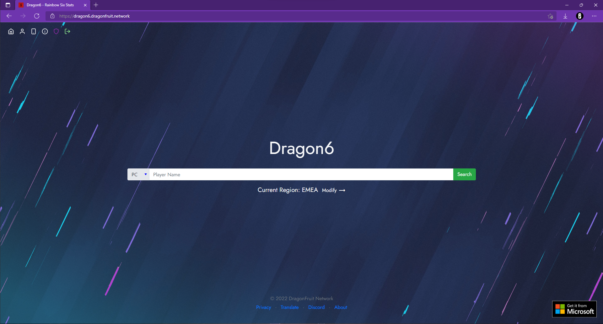

# Dragon6 Web
The Dragon6 Website acts as the core component for Dragon6 clients and services, including API, token management, Discord bot and verification services.

<!-- TODO add mobile link -->

While the website displays some stats, it can be seen as 'lightweight' compared to the [desktop](./desktop) and mobile clients.

### History
Released in early 2018, the Dragon6 website was originally written in ASP.NET Framework with no Discord bot or API. It has since been rewritten to run on .NET, using DSharpPlus to provide the Discord bot and DragonFruit.Six.Api to manage connections to the Ubisoft services.

Login support was added in June 2019, where users were able to login to set cover photos (verified accounts only) and link Discord accounts (after February 2020).