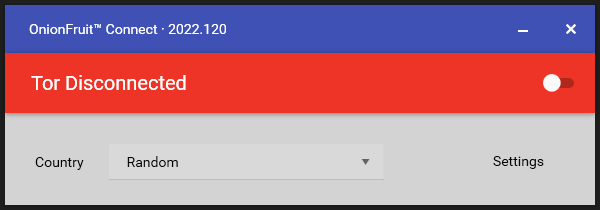

# OnionFruit™ Updater

If there is an updated version of the client, open the app and wait. The app's title bar tells you everything you need to know:

The header in the image above says `OnionFruit™ Connect · 2022.120`. This means it is up to date as the version number is shown. If it just says `OnionFruit™ Connect` it is either checking or has failed to contact GitHub for updates. If is is downloading/applying the header will update accordingly with a progress meter (`OnionFruit™ Connect · Downloading Update (63%)`).

> Closing the client while updating will send it to the taskbar until the operation has completed

OnionFruit™ uses Squirrel, an update framework that allows you to keep using the app whilst it is updating. Once an update is complete, the next time you open the app you will be using the updated version.